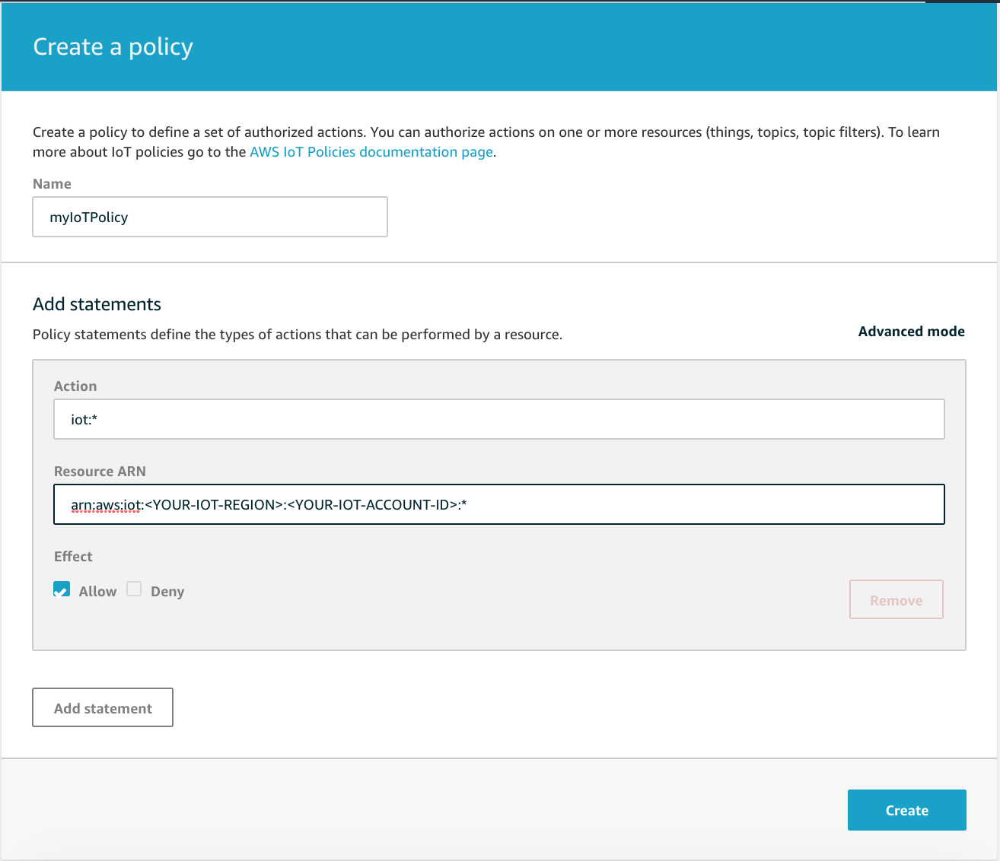

# AWS IoT
To use in your app, import `AWSIoTProvider`:
```js
import { Amplify, PubSub } from 'aws-amplify';
import { AWSIoTProvider } from '@aws-amplify/pubsub';
```
Define your endpoint and region in your configuration:
```js
// Apply plugin with configuration
Amplify.addPluggable(
  new AWSIoTProvider({
    aws_pubsub_region: '<YOUR-IOT-REGION>',
    aws_pubsub_endpoint:
      'wss://xxxxxxxxxxxxx.iot.<YOUR-IOT-REGION>.amazonaws.com/mqtt'
  })
);
```
With `<YOUR-IOT-REGION>` you can find it in `aws-exports.js`. For me, it's `<ap-northeast-2>`.
Find your `aws_pubsub_endpoint` by logging onto your `AWS Console`, choosing `IoT Core` from the list of services and then choosing `Settings` from the left navigation pane.

## Step 1: Create IAM policies for AWS IoT
To use PubSub with AWS IoT, you will need to create the necessary IAM policies in the AWS IoT Console, and attach them to your Amazon Cognito Identity.
Go to `IoT Core` and choose `Security` from the left navigation pane, and then `Policies` from the dropdown menu. Next, click `Create`. The following `myIoTPolicy` policy will allow full access to all the topics.



> **Note**
> <YOUR-IOT-ACCOUNT-ID> is also 12-digit AWS account ID.

## Step 2: Attach your policy to your Amazon Cognito Identity
You can retrieve the `Cognito Identity Id` of a logged in user with `Auth Module`:
```js
Auth.currentCredentials().then((info) => {
  const cognitoIdentityId = info.identityId;
});
```
> **Note**
> This code retrieves the Cognito Identity Id of the currently logged-in user and assigns it to the variable cognitoIdentityId. This identifier can then be used to access resources that have been granted access to the user in the identity pool.

> **Error**
> ReferenceError: Can't find variable: Auth
> How to solve? ``` import { Auth } from 'aws-amplify'; ```

> **Warnning**
> Possible Unhandled Promise Rejection (id: 0):
"No Cognito Identity pool provided for unauthenticated access"
> How to solve? 
> 1. Go to the AWS Cognito Console: https://console.aws.amazon.com/cognito/
> 2. Click on "Manage User Pools" and then click on "Create a User Pool".
> 3. Follow the steps to create a new user pool
>   - Step 1: Provider types - Cognito user pool. Cognito user pool sign-in options - Email.
>   > **Warnning**
>   > Cognito user pool sign-in options can't be changed after the user pool has been created.
>   - Step 2: 
>       - Password policy mode - Cognito defaults: Password minimum length - 8 characters
>       - MFA enforcement - No MFA
>       - Self-service account recovery: Enable self-service account recovery - Recommended
>       - Delivery method for user account recovery messages - Email if available, otherwise SMS
>   - Step 3:
>       - Self-registration: Enable self-registration
>       - Cognito-assisted verification and confirmation - Alow Cognito to automatically send messages to verify and confirm - Recommended
>       - Attributes to verify - Send email message, verify email address
>       - Verifying attribute changes - Keep original attribute value active when an update is pending - Recommended
>       - Active attribute values when an update is pending - Email address
>   - Step 4:
>       - Email provider - Send email with Cognito
>       - FROM email address - no-reply@verificationemail.com
>   - Step 5: 
>       - User pool name: poolUser
>       > **Warnning**
>       > Your user pool name can't be changed once this user pool is created.
>       - App type: Public client
>       - App client name: Amplified_pubsub
>       - Client Secret: Don't generate a client secret.
>       > **Warnning**
>       > You cannot change or remove a client secret after you allow Amazon Cognito to generate it for your app client.
>   - Step 6: Save your `Pool ID`
> 4. Once the user pool is created, click on `Manage Federated Identities` and then click on `Create new identity pool`.
> 5. Give your identity pool a name and select the option to allow unauthenticated access - pubsub; Allow Basic (Classic) Flow.
> 6. Click on "Create Pool".
> 7. Update the aws-exports.js file with the new identity pool id and region.

> **Warnning**
> Possible Unhandled Promise Rejection (id: 2): "No Cognito Identity pool provided for unauthenticated access"
> How to solve?
> ```
> AWS.config.update({region: 'REGION'});
> ```
> > **Error**
> > ReferenceError: Can't find variable: AWS
> > How to solve?
> > ```npm install aws-sdk
> > import AWS from 'aws-sdk';
> > ```
>>
> > **Warnning**
> > Possible Unhandled Promise Rejection (id: 1): "region is not configured for getting the credentials"
> > How to solve? Add 3 field: `aws_project_region`, `aws_cognito_identity_pool_id` and `aws_cognito_region`

Then, you need to send your `Cognito Identity Id` to the AWS backend and attach `myIoTPolicy`. You can do this with the following AWS CLI command:
```bash
aws iot attach-policy --policy-name 'myIoTPolicy' --target '<YOUR_COGNITO_IDENTITY_ID>'
```
> **Error** 
> An error occurred (AccessDeniedException) when calling the AttachPolicy operation: User: user/anhttm8 is not authorized to perform: iot:AttachPolicy on resource:... because no identity-based policy allows the iot:AttachPolicy action
> How to solve?
> I dont know :(())

## Step 3: Allow the Amazon Cognito Authenticated Role to access IoT Services